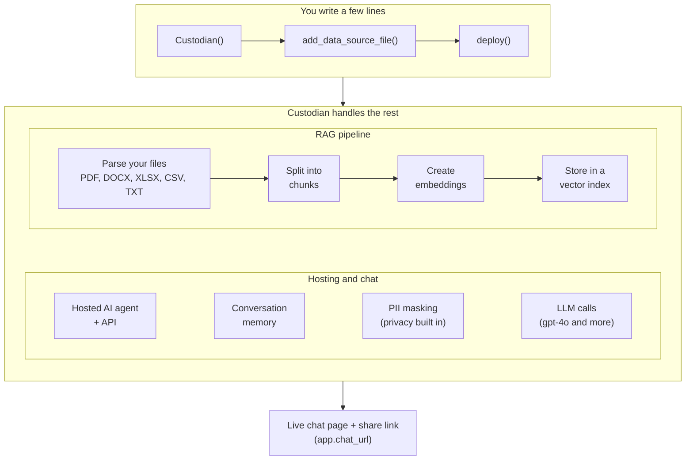

# Custodian Labs Python Samples


**Fastest way to deploy AI-agents with privacy built in.**

Describe your agent in a few lines of Python. Custodian handles the  pipeline, hosting, conversation memory and PIIs, and gives you a live chat link to share.

Example scripts for the [`custodian-labs`](https://pypi.org/project/custodian-labs/) Python SDK.

- **Docs:** https://docs.custodianlabs.io
- **Dashboard (API keys):** https://dashboard.custodianlabs.io

---

## How It Works

Your script describes an AI agent, and the Custodian platform builds, hosts and runs it.




### Multi-agent teams

A `CustodianSquad` is several AI agents behind one app. Each agent runs the chat flow above with its own prompt and files. The routing mode decides which agents run for each message:

| Routing mode | Which agents answer |
|---|---|
| `single` | One agent: the one whose `topics` keywords appear in the message |
| `workflow` | All agents, in `workflow_order`; each one's answer is passed to the next |
| `chain` | Starts with the topic-matched agent, then hands off to the agents in its `can_handoff_to` |

See it side by side in `04_multi_agent_team_routing.py`.

### GuardianLayer

GuardianLayer is a separate service you call directly to mask PII in your own text or files. It doesn't deploy anything, and uses the same API key.

---

## Install

```bash
pip install custodian-labs
```

That's all the examples need, except the WebSocket bridge, whose extra installs are listed at the top of its file.

---

## Set Your API Key

Get your key from the [Dashboard](https://dashboard.custodianlabs.io) under **API Keys**, then pick one of these:

**Option 1: `.env` file (recommended).** Copy the example file and paste your key into it:

```bash
cp .env.example .env
```

```bash
# .env
CUSTODIAN_SDK_API_KEY=custodian_labs_xxxx...
```

The SDK finds `.env` in the folder you run a script from (or any parent folder). `.env` is in `.gitignore`, so your key never gets committed. Requires `custodian-labs` 0.2.4 or newer (`pip install -U custodian-labs`).

**Option 2: set it in your terminal** (lasts until you close the terminal):

macOS / Linux:
```bash
export CUSTODIAN_SDK_API_KEY="custodian_labs_xxxx..."
```

Windows (PowerShell):
```powershell
$env:CUSTODIAN_SDK_API_KEY = "custodian_labs_xxxx..."
```

**Option 3: Google Colab / Jupyter.** Set it in a cell before creating any `Custodian` or `GuardianLayer`:

```python
import os
from getpass import getpass

os.environ["CUSTODIAN_SDK_API_KEY"] = getpass("Enter your Custodian Labs API key: ")
```

Tip for Colab: save the key once in the **Secrets** panel (🔑 in the left sidebar), then use `userdata.get` instead of pasting it each session:

```python
import os
from google.colab import userdata

os.environ["CUSTODIAN_SDK_API_KEY"] = userdata.get("CUSTODIAN_SDK_API_KEY")
```

If a key is set in more than one place, a key passed in code (`api_key=...`) wins, then a terminal/`os.environ` variable, then `.env`.

---

## Plans

| | Free | Pro |
|---|---|---|
| Deployed Custodians | 1 | Multiple (incl. CustodianSquads) |
| Models | `gpt-4o` only | All supported models |
| Usage credits & API requests | Limited monthly | Higher limits |

On the Free plan, any `model=` you pass is ignored and requests run on `gpt-4o`. Each sample deploys a new Custodian, so to try another sample on Free, first delete the previous deployment under **My AIs** in the [Dashboard](https://dashboard.custodianlabs.io), or upgrade to Pro.

Every chat message and GuardianLayer call uses usage credits and counts toward your API key's request limit. When they run out, requests fail until your plan cycle renews or you upgrade. The Dashboard shows your current limits and what's left.

---

## Samples

### AI Agents & Assistants

| File | What it shows |
|---|---|
| `01_AI_agent_RAG.py` | Deploy a production-ready (+RAG) AI agent in 5 lines (not including spaces) |
| `02_Agent_few_shot_learning.py` | Add few-shot examples to guide the assistant's responses |
| `03_Agent_builder_chain.py` | Fluent `CustodianBuilder` chain — configure and deploy in one expression |
| `04_multi_agent_team_routing.py` | Multi-agent team (`CustodianSquad`) compared across `single`, `workflow` and `chain` routing (Pro) |

### Application Examples

Real-world AI agents you can run and adapt, in [`application_examples/`](application_examples/):

| File | Use case |
|---|---|
| `application_examples/legal_contract_assistant.py` | Legal assistant that answers questions about a contract (PDF) |
| `application_examples/cv_recruiter_assistant.py` | Share an AI agent that answers recruiters' questions about your CV (DOCX) |

Built something useful? [Submit your own example](application_examples/README.md#submit-your-own-example) via a pull request.

### GuardianLayer — PII & Proprietary Data Masking

| File | What it shows |
|---|---|
| `guardian_layer_examples/01_simple_guardian_layer_text.py` | Find sensitive words in text and compare the `redact`, `placeholder` and `transform` masking styles |
| `guardian_layer_examples/02_simple_guardian_layer_file.py` | Mask PII in a file (CSV, XLSX, DOCX, PDF, TXT) and save the masked copy |

### WebSocket Bridge

| File | What it shows |
|---|---|
| `websocket_examples/01_simple_websocket_bridge.py` | FastAPI WebSocket server that proxies chat through the SDK |
| `websocket_examples/02_simple_websocket_browser.html` | Browser client for the WebSocket bridge |

---

## Running a Sample

Run any script from the **repo root** (so that `data_examples/` paths resolve correctly):

macOS / Linux:
```bash
python 01_AI_agent_RAG.py
```

Windows (PowerShell):
```powershell
python 01_AI_agent_RAG.py
```

**WebSocket sample** — requires `fastapi` and `uvicorn` with WebSocket support:

```bash
pip install fastapi "uvicorn[standard]"
uvicorn websocket_examples.01_simple_websocket_bridge:app
```

Then open `websocket_examples/02_simple_websocket_browser.html` in a browser.

The server deploys its AI agent once at startup, so avoid `--reload` (every reload would create a new deployment).

---

## SDK Quick Reference

**Single assistant (high-level)**
```python
from custodian_labs import Custodian

app = Custodian(model="gpt-4o", system_prompt="You are a helpful assistant.")
app.add_data_source_file("data_examples/car_info.csv")
deployed = app.deploy()

reply = deployed.chat("What cars are available?")
print(reply.response)
```

**Builder chain**
```python
from custodian_labs import CustodianBuilder

app = (
    CustodianBuilder()
    .with_model("gpt-4o")
    .with_prompt("You are a helpful assistant.")
    .deploy()
)
reply = app.chat("Hello!")
print(reply.response)
```

**Agent team (multi-agent, Pro)**
```python
from custodian_labs import Custodian, CustodianSquad

team = CustodianSquad(
    custodians=[
        Custodian(name="billing", model="gpt-4o", system_prompt="Handle billing.", topics=["billing"]),
        Custodian(name="support", model="gpt-4o", system_prompt="Handle support.", topics=["support"]),
    ],
    routing_mode="single",  # single | workflow | chain
)
app = team.deploy()
reply = app.chat("I have a question about my billing.")
print(reply.response, reply.selected_agent)
```

**PII masking**
```python
from custodian_labs import GuardianLayer

guardian = GuardianLayer()

# Text
outputs = guardian.deidentify_text_outputs("John Smith, 617-555-0100", masking_type="redact")
for item in outputs.outputs:
    print(item.text)

# File (auto-dispatches by extension: csv, docx, pdf, txt)
result = guardian.deidentify_file("data_examples/pii_data.csv", masking_type="transform")
print(result.text())
```

---

## Environment Variables

| Variable | Default | Purpose |
|---|---|---|
| `CUSTODIAN_SDK_API_KEY` | — | API key for all assistant/agent calls |
| `CUSTODIAN_SDK_BASE_URL` | `https://platform.custodianlabs.io/v1` | Override the assistant API host |
| `CUSTODIAN_MASKING_BASE_URL` | `https://privacy.custodianlabs.io` | Override the masking API host |
